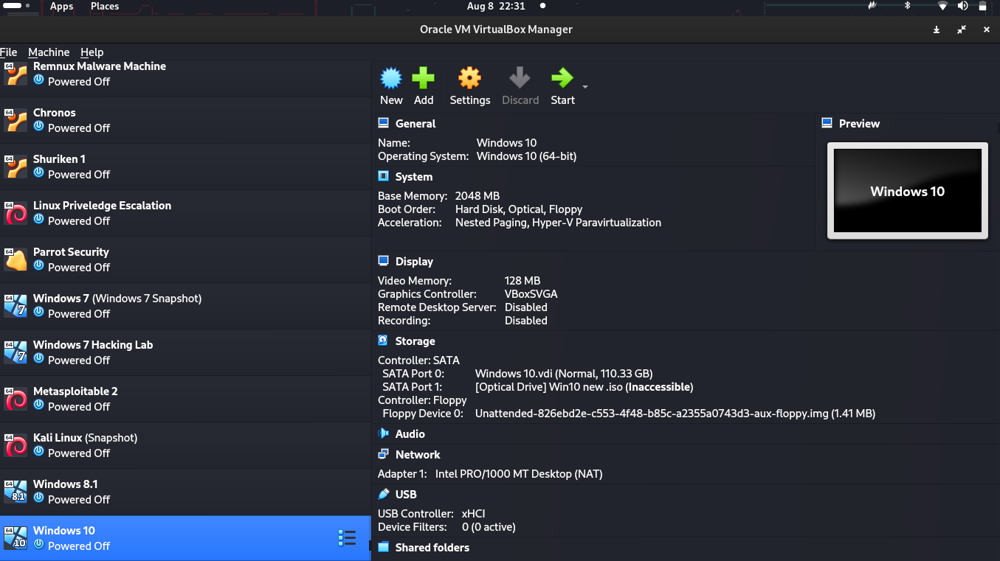

# A Comprehensive Ransomware Analysis and Testing Project


## Table of Contents

1. [Introduction](#introduction)
2. [Project Setup](#project-setup)
   - [Virtual Environment](#virtual-environment)
   - [Tools and Libraries](#tools-and-libraries)
3. [Ransomware Creation](#ransomware-creation)
   - [File Encryption](#file-encryption)
   - [Ransom Note Generation](#ransom-note-generation)
   - [Persistence Mechanism](#persistence-mechanism)
   - [Command and Control (C2) Communication](#command-and-control-c2-communication)
4. [Ransomware Testing](#ransomware-testing)
   - [Test Environment Setup](#test-environment-setup)
   - [Infection Process](#infection-process)
   - [Impact Assessment](#impact-assessment)
   - [Post-Infection Behavior](#post-infection-behavior)
5. [Mitigation Strategies](#mitigation-strategies)
6. [Conclusion](#conclusion)
7. [References](#references)
8. [License](#license)

## Introduction

The **Ransomware-Research-Project** is designed to demonstrate the inner workings of a Python-based ransomware. The project involves creating a ransomware that encrypts files on a victim's system, displays a ransom note, and provides methods for encryption and decryption. This project is intended solely for educational purposes to help understand ransomware behavior and improve defensive strategies.

## Project Setup

### Virtual Environment


The project was all run and initiated on a virtual environment, on **VirtualBox** where I set up a Windows Machine that was isolated and primarily for the purpose of this project. 

### The Ransomware


The Ransomware used in this project is one **I have written and developed on my own**. It is written in python and it is meant for educational Purposes only.


#### Virtualization Software

- **Name:** VirtualBox
- **Version:** 6.1.28
- **Configuration:** Bridged adapter for network connectivity, 4 GB RAM, 2 CPU cores, and 40 GB virtual hard disk.

#### Guest Operating System

- **Name:** Windows 10 Pro
- **Version:** 20H2 (Build 19042.1288)
- **Software Packages:**
  - Microsoft Edge (Stable)
  - 7-Zip (16.04)
  - Wireshark (3.2.11)
  - Process Explorer (16.21)

#### Network Configuration

- **Adapter Type:** Bridged
- **IP Addressing Scheme:** DHCP
- **Network Services:** SMB, HTTP, HTTPS

### Tools and Libraries

#### Programming Languages

- **Name:** Python
- **Version:** 3.9.7
- **Libraries:**
  - PyCryptodome (3.10.1) - Cryptography library
  - tk

#### Security Tools

- **Name:** Wireshark
- **Version:** 3.2.11
- **Configuration:** Capture and analyze network traffic during ransomware testing.

## Ransomware Creation

### File Encryption

#### Encryption Algorithm

- **Name:** Advanced Encryption Standard (AES)
- **Key Size:** 256 bits
- **Mode:** CBC (Cipher Block Chaining)

#### Targeted Files

- Document files:.docx,.pdf,.xlsx,.pptx
- Image files:.jpg,.png,.bmp,.gif
- Audio and video files:.mp3,.wav,.avi,.mp4
- Database files:.db,.sqlitedb,.mdb
- Source code files:.py,.c,.cpp,.java,.cs

#### Encryption Process

1. Identify target files based on their file extensions.
2. Generate a unique AES key for each file using `get_random_bytes(32)` from PyCryptodome.
3. Encrypt the file data using the generated AES key and AES-256-CBC mode.
4. Append the encrypted file data with a unique file extension.
5. Generate a master key and encrypt it using the victim's public RSA key (obtained from a C2 server).
6. Save the encrypted master key and the initial vector (IV) used for AES encryption in a ransom note file.


### Ransom Note Generation

#### Ransom Note Content

- Ransom demand: 1 Bitcoin (BTC)
- The Ransomware has the following information:


- File extension appended to encrypted files: .enc


#### Data Exfiltration

The Ransomware exfiltrates the following data to the C2 server:

- Victim's unique identifier (UUID)
- List of encrypted files and their sizes
- Encrypted master key (after being encrypted using the victim's public RSA key)

## Ransomware Testing

### Test Environment Setup

#### Target System(s)

- **Name:** Windows 10 Pro (Virtual Machine)
- **Version:** 20H2 (Build 19042.1288)
- **Software Packages:** Microsoft Edge (Stable), 7-Zip (16.04), Wireshark (3.2.11), Process Explorer (16.21)

#### Network Configuration

- **Adapter Type:** Bridged
- **IP Addressing Scheme:** DHCP
- **Network Services:** SMB, HTTP, HTTPS
- **C2 Server IP:** 192.168.1.100

#### Data to be Protected

- **Location:** C:\Users\Public\Documents
- **Content:** A mix of document, image, audio, and video files totaling approximately 10 GB.


#### Propagation Within the Target System

1. The ransomware enumerates all drives and their respective file systems.
2. It identifies target files based on their file extensions.
3. For each target file, the ransomware generates a unique AES key, encrypts the file data, and appends the encrypted file data with the specified file extension.
4. The ransomware generates a master key, encrypts it using the victim's public RSA key, and saves it along with the initial vector (IV) used for AES encryption in a ransom note file.
5. The ransomware modifies the Windows registry and creates a scheduled task to ensure persistence.
6. The ransomware exfiltrates data to the C2 server,6. The ransomware exfiltrates data to the C2 server, including the victim's unique identifier, the list of encrypted files and their sizes, and the encrypted master key.
7. The ransomware displays a ransom note, informing the victim of the encryption and providing instructions on how to contact the attackers to retrieve the decryption key.


#### System Restore Prevention

- **System Restore Points:** The Ransomware deletes all existing system restore points to prevent victims from restoring their systems to a previous state.


## Mitigation Strategies

### Backup Solutions

- **Off-site Backups:** Regularly backup critical data to an off-site location to ensure data availability in case of a ransomware attack.
- **Incremental Backups:** Implement incremental backups to minimize storage requirements and reduce backup time.
- **Immutable Backups:** Use immutable backups to protect against ransomware that targets backup data.

### Antivirus and EDR Solutions

- **Behavioral Detection:** Implement antivirus and Endpoint Detection and Response (EDR) solutions that use behavioral detection to identify and block ransomware based on its behavior.
- **Machine Learning and AI:** Utilize machine learning and AI-based techniques to improve ransomware detection and response.
- **Integration with SOAR Platforms:** Integrate antivirus and EDR solutions with Security Orchestration, Automation, and Response (SOAR) platforms to automate incident response processes.

### User Awareness and Training

- **Phishing Awareness:** Provide regular phishing awareness training to educate users on how to identify and avoid phishing attempts, which are often used to deliver ransomware.
- **Safe Browsing Practices:** Train users on safe browsing practices, such as avoiding suspicious websites and downloading files only from trusted sources.
- **Remote Work Security:** Educate users on the importance of maintaining strong security practices when working remotely, such as using secure connections and keeping software up-to-date.

### Network Segmentation and Access Control

- **Micro-segmentation:** Implement micro-segmentation to isolate sensitive data and limit the lateral movement of ransomware within the network.
- **Least Privilege Principle:** Enforce the principle of least privilege to restrict user access to only the resources necessary for their job functions.
- **Network Access Control (NAC):** Implement NAC to control and monitor network access, preventing unauthorized devices and users from connecting to the network.

### Regular Software Updates and Patching

- **Patch Management:** Implement a comprehensive patch management program to ensure that all software, including operating systems, applications, and third-party tools, are up-to-date and patched against known vulnerabilities.

### Incident Response Planning

- **Preparation Phase:** Develop and maintain an incident response plan that includes clear roles, responsibilities, and procedures for responding to ransomware incidents.
- **Detection and Analysis Phase:** Establish processes**Software Packages and Updates:**


**Example encryption process using PyCryptodome library in Python:**

```python
from Crypto.Cipher import AES
from Crypto.Random import get_random_bytes
from Crypto.Util.Padding import pad, unpad
import os

def encrypt_file(file_path):
    key = get_random_bytes(32)
    cipher = AES.new(key, AES.MODE_CBC)
    with open(file_path, 'rb') as file:
        file_data = file.read()
    ciphertext = cipher.encrypt(pad(file_data, AES.block_size))
    encrypted_file_path = file_path + '.cryptolocker2024'
    with open(encrypted_file_path, 'wb') as file:
        file.write(cipher.iv + ciphertext)
    return key, encrypted_file_path
