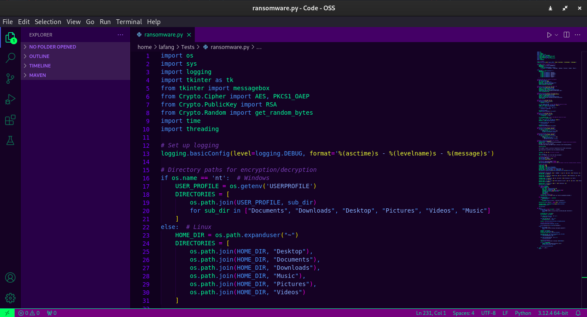
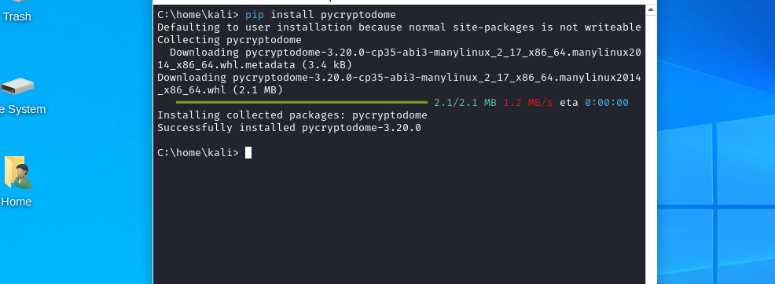
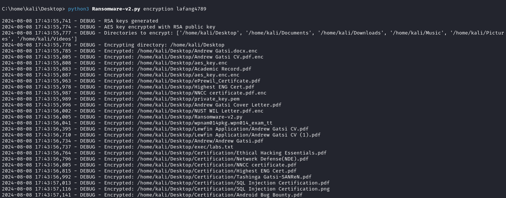
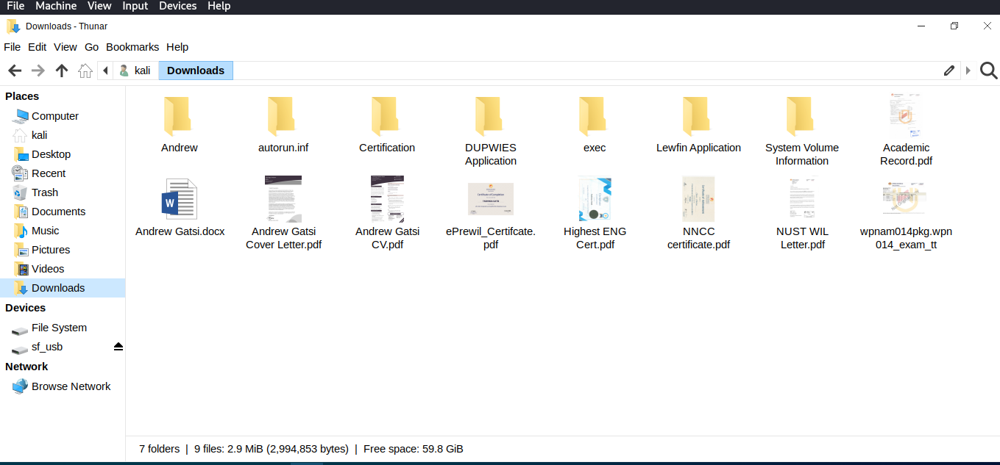
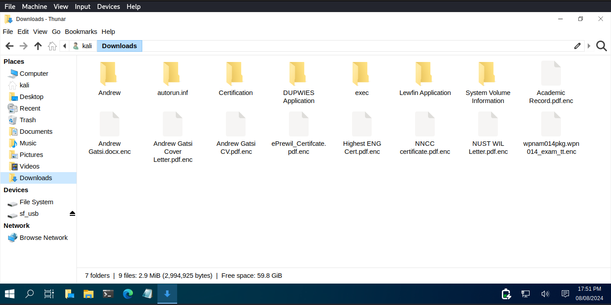

# A Comprehensive Ransomware Analysis and Testing Project


## Table of Contents
1. [Introduction](#introduction)
2. [Project Setup](#project-setup)
   - [Virtual Environment](#virtual-environment)
   - [Tools and Libraries](#tools-and-libraries)
3. [Ransomware Creation](#ransomware-creation)
   - [File Encryption](#file-encryption)
   - [Ransom Note Generation](#ransom-note-generation)
4. [Ransomware Testing](#ransomware-testing)
   - [Test Environment Setup](#test-environment-setup)
   - [Infection Process](#infection-process)
   - [Impact Assessment](#impact-assessment)
   - [Post-Infection Behavior](#post-infection-behavior)
5. [Mitigation Strategies](#mitigation-strategies)
6. [Conclusion](#conclusion)
7. [References](#references)
8. [License](#license)

## Introduction

The **Ransomware-Research-Project** is designed to demonstrate the inner workings of a Python-based ransomware. The project involves creating a ransomware that encrypts files on a victim's system, displays a ransom note, and provides methods for encryption and decryption. This project is intended solely for educational purposes to help understand ransomware behavior and improve defensive strategies.

## Project Setup

### Virtual Environment


The project was all run and initiated on a virtual environment, on **VirtualBox** where I set up a Windows Machine that was isolated and primarily for the purpose of this project. 

### The Ransomware



The Ransomware used in this project is one **I have written and developed on my own**. It is written in python and it is meant for educational Purposes only.

### Tools and Libraries
**The following libraries are used in this project:**

  1. PyCryptodome: For cryptographic operations such as AES and RSA.
  2. Tkinter: For creating the ransom note GUI.


Install the required libraries using pip:
```bash
pip install pycryptodome
```

### Ransomware Creation
**File Encryption**
The ransomware encrypts files using AES-256-CTR. Here's how it works:

1. An AES key of 256 bits is generated using the get_random_bytes function. This key will be used to encrypt files.
2. **Encrypting Files**: Each file in the target directories is encrypted using AES-256-CTR mode. The AES key ensures that the encryption is strong and secure.

```python
def encrypt_file(file_path, aes_key):
    with open(file_path, 'rb') as f:
        plaintext = f.read()
    iv = get_random_bytes(8)  # 8-byte IV for AES.MODE_CTR
    cipher = AES.new(aes_key, AES.MODE_CTR, nonce=iv)
    ciphertext = cipher.encrypt(plaintext)
    with open(file_path + '.enc', 'wb') as f:
        f.write(iv + ciphertext)
    os.remove(file_path)
```
 . **Initialization Vector (IV)**: A random 8-byte value used for encryption to ensure that the same plaintext encrypts to different ciphertexts each time.
 . **AES.MODE_CTR**: A counter mode for AES that turns the block cipher into a stream cipher.

 3. **Saving Encrypted Files:**
Encrypted files are saved with a .enc extension, and the original files are deleted to ensure the user cannot access them without decryption.


### Ransom Note Generation
The ransomware displays a ransom note to the user, demanding payment in Bitcoin to decrypt the files. This note is presented using a Tkinter-based GUI:

 1. **Bitcoin Wallet**: The ransom note contains a Bitcoin wallet address where the victim is instructed to send the ransom.

 2. **Countdown Timer**: A 72-hour countdown timer is implemented, after which the ransomware threatens to permanently delete the encryption keys, rendering the files unrecoverable.

```python
def display_ransom_note(password):
    bitcoin_wallet = "1FfmbHfnpaZjKFvyi1okTjJJusN455paPH"
    ...
```
3. **Password Verification**: The ransom note includes a field where the victim can enter a decryption password (provided after payment). If the correct password is entered, the ransomware's GUI will close.

## Ransomware Testing

Testing the ransomware should be conducted in a controlled environment to prevent unintended damage. Follow these steps to set up the testing environment:

### Test Environment Setup

#### VirtualBox Setup

1. **Install VirtualBox**:
   - Download and install [VirtualBox](https://www.virtualbox.org/).

2. **Create a New Windows Virtual Machine**:
   - Open VirtualBox and create a new virtual machine with a Windows operating system.

3. **Install Python and Required Libraries**:
   - Inside the virtual machine, install Python and the necessary libraries using pip:
     ```bash
     pip install pycryptodome
     ```
     


4. **Isolate the Virtual Machine**:
   - Ensure that the virtual machine is isolated from the host network to prevent accidental spread of the ransomware. This can typically be done by configuring the network settings to use "Host-only Adapter" or "Internal Network".

#### Snapshot Creation

1. **Create a Snapshot**:
   - Before running the ransomware, create a snapshot of the virtual machine. This allows you to restore the machine to its previous state after testing.
   - In VirtualBox, go to the "Snapshots" tab and click the "Take" button to create a snapshot.


## Infection Process

### Executing the Ransomware

1. **Run the Ransomware Script**:
   - Execute the ransomware script within the virtual machine using the command:
     ```bash
     python3 ransomware_script.py <encryption_password>
     ```
   - The script will encrypt files in the specified directories, display the ransom note, and establish persistence.
  




### File Encryption Verification

Before the encryption, there are files that are put in the Downloads, Desktop, Music and Videos etc. directories as shown below




1. **Verify File Encryption**:
   - After execution, check that files in the targeted directories have been encrypted and are now inaccessible without decryption.
   - Files should be renamed with the `.enc` extension.
  


### Ransom Note Verification

1. **Confirm Ransom Note Display**:
   - Ensure that the ransom note appears as expected with a functioning countdown timer and password entry field.
   - The countdown should be decrementing, and the password field should correctly prompt for user input.

  

## Video Proof

You can view the video proof of the ransomware in action here:

[](screenshots/proof.webm)


## Impact Assessment

The impact assessment involves evaluating the ransomware’s effect on the system:

### File Availability

1. **Check File Encryption**:
   - Confirm that files in the targeted directories are encrypted and have been renamed with the `.enc` extension.

### System Performance

1. **Monitor System Performance**:
   - Observe system resource usage, including CPU and memory, to assess the impact of the ransomware on system performance.

### Persistence Verification

1. **Verify Ransomware Persistence**:
   - Restart the virtual machine and ensure that the ransomware re-executes upon reboot, verifying its persistence mechanism.

## Post-Infection Behavior

Post-infection, the ransomware may exhibit the following behaviors:

### Countdown Progression

1. **Observe Countdown Timer**:
   - Verify that the countdown timer in the ransom note continues to decrement correctly.

### C2 Communication

1. **Check for C2 Communication**:
   - If implemented, the ransomware may attempt to contact a Command and Control (C2) server for further instructions or to report the infection status.

## Mitigation Strategies

To protect against ransomware infections, consider the following strategies:

### Regular Backups

1. **Maintain Regular Backups**:
   - Regularly back up critical data and store backups offline or in a secure cloud environment to prevent them from being encrypted by ransomware.

### Endpoint Protection

1. **Use Advanced Protection**:
   - Employ advanced antivirus and Endpoint Detection and Response (EDR) solutions to detect and prevent ransomware infections.

### User Awareness

1. **Educate Users**:
   - Train users to recognize phishing attacks and ransomware. Stress the importance of not opening suspicious emails or clicking on unknown links.

### Network Segmentation

1. **Segment Your Network**:
   - Implement network segmentation to limit the spread of ransomware. This helps prevent ransomware from propagating across the entire network in case of an infection.

### Incident Response Plan

1. **Develop an Incident Response Plan**:
   - Create and regularly update an incident response plan to quickly and effectively respond to ransomware attacks.
